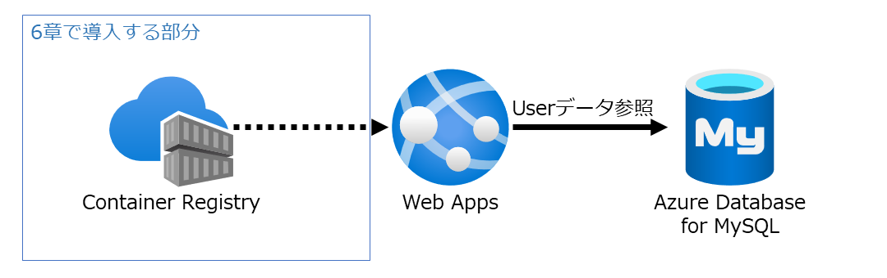

# flask-mvc
This Flask application is an example of MVC pattern using MySQL  
https://aadojo.alterbooth.com/entry/2021/12/06/030047



## Create `/src/.env` if using Azure Database for MySQL
> Sets `BaltimoreCyberTrustRoot.crt.pem` under `/src`  
> https://docs.microsoft.com/ja-jp/azure/mysql/howto-configure-ssl#step-1-obtain-ssl-certificate

```
SQLALCHEMY_DATABASE_URI=mysql://<user_name>:<password>@<host>/<db_name>?ssl_ca=BaltimoreCyberTrustRoot.crt.pem
```
